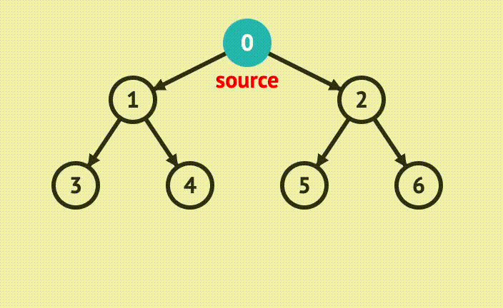

# Bfs (너비 우선 탐색, Breadth-First Search), Dfs (Depth First Search)
BFS는 그래프 탐색 알고리즘이다. 루트 노드(혹은 다른 임의의 노드)에서 시작해서 인접한 노드를 먼저 탐색하는 방법이다 즉, 정점들과 같은 레벨에 있는 노드들을 먼저 탐색한다.  
DFS는 깊이를 우선 탐색한다. 같은 레벨이 아니라 바로 아래 레벨에 있는 자식 노드의 끝까지 탐색하고 자식이 없다면 돌아오는 방식이다.

## 진행 순서 예시
아래와 같은 그래프가 있는 경우 BFS와 DFS의 탐색 순서를 알아보면 다음과 같다.

- BFS 
  - 다음 레벨로 하나씩 넘어가면서 같은 레벨에 있는 노드들을 먼저 방문한다.
  - 실행순서 : 0 -> 1 -> 2 -> 3 -> 4 -> 5 -> 6
- DFS 
  - 한 노드의 자식을 끝까지 방문하고, 다시 타고 올라와서 다른 노드의 자식을 타고 동일하게 끝까지 방문한다.
  - 실행순서 : 0 -> 1 -> 3 -> 4 -> 2 -> 5 -> 6 

 

  

  

